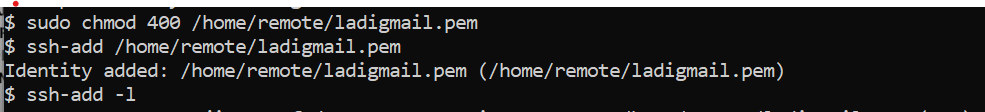
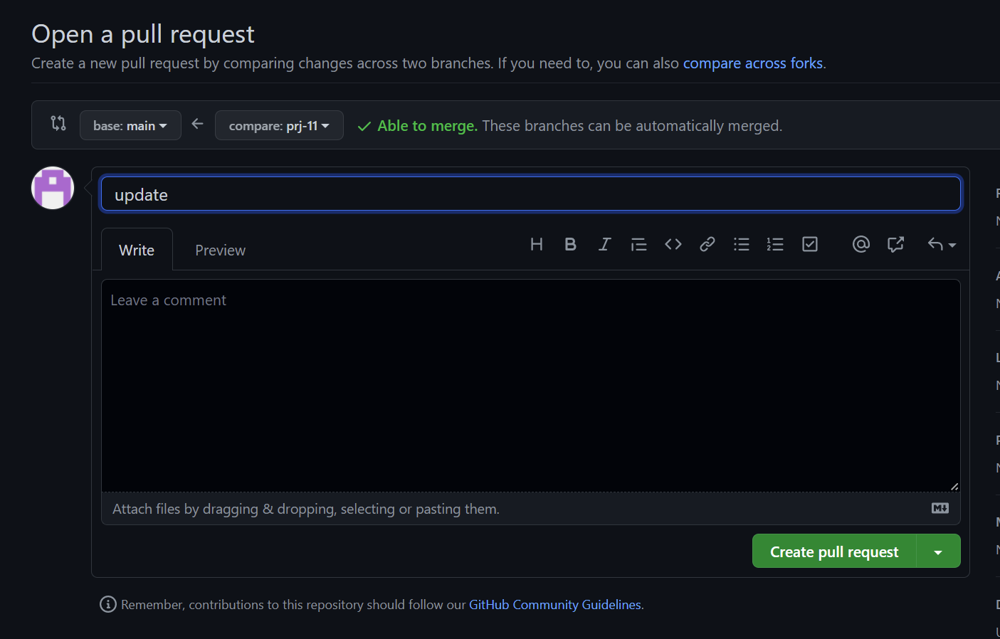

# ANSIBLE CONFIGURATION MANAGEMENT

## Install and configure Ansible client to act as a Jump Server/Bastion Host 

Create an EC2 instance that will serve as ansible and jenkins server

Update the instance 

`sudo apt update`

Install Ansible

`sudo apt install ansible`

Check Ansible version 

`ansible --version`

Install jenkins and verify its running 

Create a github repository 

Create a freestyle project "ansible" in jenkins and point it to a github repository 

Configure a Post-build job to save all (**) files

Configure webhooks on github repo for the ansible-config-mgt repository 

Test your setup by making some change in README.MD file

Make sure the build starts automatically 

Check if jenkins saved the build artifact on server 

`ls /var/lib/jenkins/jobs/ansible/builds/5/archive/`

 

Using VS code clone ansible-config-mgt repo to jenkins-ansible instance 

`git clone https://github.com/ladifa1/ansible-config-mgt.git`

In your ansible-config-mgt GitHub repository, create a new branch

Create a directory and name it playbooks 

Create a directory and name it inventory 

Within the playbooks folder, create common.yml

Within the inventory folder, create the following .yml files  dev, staging, uat, and prod respectively.

##  Set up an Ansible Inventory

Setup SSH agent and connect VS Code to your Jenkins-Ansible instance on your local machine

Confirm the key has been added

`ssh-add -l`

SSH into your Jenkins-Ansible server using ssh-agent

`ssh -A ubuntu@public-ip`

 

Update your inventory/dev.yml file with code

Update your playbooks/common.yml file

Push changes and merge with Github main repo

Confirm Jenkins build started automatically

check build artifacts on server

`ls /var/lib/jenkins/jobs/ansible/builds/7/archive/playbooks/common.yml`

## Run first Ansible test

Change directory to ansible-config-mgt

`cd ansible-config-mgt`

Execute ansible playbook

`ansible-playbook -i /var/lib/jenkins/jobs/ansible/builds/16/archive/invenotry/dev.yml /var/lib/jenkins/jobs/ansible/builds/16/archive/playbooks/common.yml`

Check each of the servers to see if wireshark has been installed

